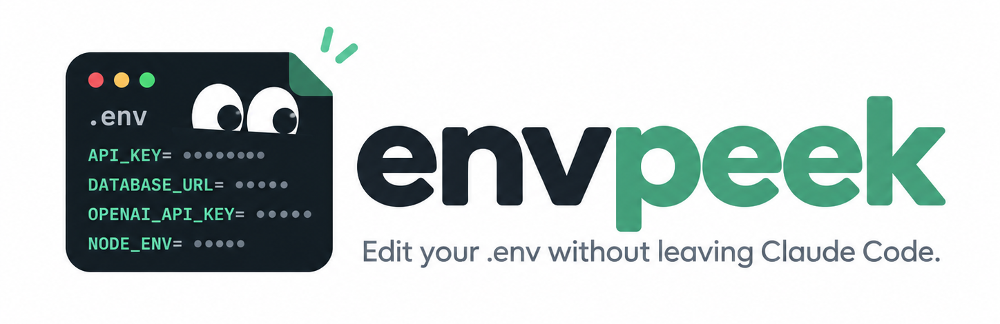

<p align="center">
  
</p>

# envpeek

Tired of opening VS Code only to edit `.env` while coding? Edit your `.env` without leaving Claude Code. A pane that lists your keys, hides the values, and saves edits in place.

envpeek is a mod for Claude Code. `/env` opens a pane on the `.env` file of the folder you are working in, where you can change a value, add a key or delete one.

## What it does

- **`/env`** opens the pane on `.env` in the current folder. `/env .env.local` opens another file.
- **Values are hidden by default.** Each key shows as dots until you select it or press "Show values".
- **Select a key to edit it.** The value appears in a text field; Enter saves.
- **Add** a key by typing `KEY=value`. If the folder has no `.env` yet, the first add creates it.
- **Delete** the selected key.
- **A folder / file picker** appears when the project has more than one: `.env`, `.env.local`, `backend/.env`, `frontend/.env.local`. It looks in the working folder and two folders below, skipping hidden, dependency and build folders. `/env backend/.env` starts one that does not exist yet.
- **A button above the prompt** opens the pane in one click. "hide" tucks it away into one line under the prompt; `/env show` brings it back, `/env hide` does the same from the keyboard.

## What it does to your file

- Only the line you change is rewritten. Comments, blank lines, key order and `export` prefixes stay exactly as they were.
- The file is read again before every save, so an edit made somewhere else in the meantime is kept.
- A value is whatever follows `=`, as written. envpeek does not add or strip quotes.

## What the mod does, hook by hook

envpeek is one hooks module with four hooks. This is all of them.

| Hook | When it runs | What it does |
|---|---|---|
| `session.start` | once, when a session starts | registers the `/env` command and reads one saved setting (is the button hidden) |
| `command.run` for `/env` | when you type `/env` | opens the pane on the `.env` file you named, or hides or shows the button for `/env hide` and `/env show` |
| `ui.render` for the row above the prompt | when that row is drawn | draws the `.env` button and the `hide` control; checks only whether the file exists |
| `ui.render` for the pane | while the pane is open | reads the selected `.env` file and draws its keys, with values hidden; saves an edit when you press Enter |

It adds one slash command (`/env`). It adds no tools, no agents, no MCP servers, and it does not hook tool calls, prompts or the model.

## What the mod writes

envpeek is an editor for `.env` files, so writing them is its purpose. It writes exactly two things:

1. **The `.env` file you are editing**, and only when you press Enter on a value, add a key, or press Delete. The file is always one named `.env` or `.env.<something>` inside the working folder, such as `.env`, `.env.local` or `backend/.env`. Each save rewrites the one line you changed.
2. **One setting in the mod's own store:** `bandHidden`, true or false, so the button stays hidden across sessions.

It never writes a build file, a start-up file, a shell profile, a Claude Code settings or instructions file, or anything outside the working folder.

## Why it reads the file instead of asking for values

A plugin that needs a secret for itself should ask for it through a `user_config` option. envpeek needs no secret of its own. The values it shows are your project's, in a file you already keep, and editing that file in place is the whole feature, so there is nothing to move into plugin settings. It reads a `.env` file only while the pane is open, and it keeps, sends and logs none of what it reads.

## Security and privacy

What the mod can reach, in full:

| It does | It never does |
|---|---|
| reads and writes `.env` files inside the working folder | open any other file: `/env ~/.ssh/id_rsa`, `/env ../x` and `/env notes.txt` are refused |
| lists the working folder and up to two folders below it to find `.env*` files (names only) | follow a symbolic link: a linked `.env` is shown as refused and left alone |
| keeps one setting across sessions: whether the button is hidden | make a network request or start a process |
| draws its pane, its button and one status line | write a value into the transcript, a toast, a log or its own state |

- **Values are hidden by default** and hidden again every time the pane is opened.
- **The file's contents are read only while the pane is open.** The button above the prompt checks that the file exists and nothing more.
- **One entry is one line.** A value with a pasted line break is refused, so it cannot add a second key.
- **The file is checked again at the moment of saving**, not only when the pane was drawn.
- **"Show values" and selecting a key put that value on your screen**, as opening the file would. Mind screen shares. What Claude Code itself does with a pane's contents is the app's behaviour, not something a mod controls; envpeek passes no value to the model.

You can confirm the list above without reading the code: `claude plugin validate .` prints every engine call the mod makes.

## Install

envpeek needs a Claude Code build with mod support. It was built and tested on 2.1.288 (the desktop app's Code tab); 2.1.132 does not load it.

```bash
git clone https://github.com/Oxde/envpeek.git
claude --plugin-dir ./envpeek
```

## Where it runs

| Surface | Pane | Button above the prompt |
|---|---|---|
| Terminal | yes | yes |
| Desktop app | yes | yes |
| VS Code | yes | yes |
| Mobile | no: the app draws no text field yet | yes |

## Limits

- The strip above the prompt belongs to Claude Code. A mod chooses what sits in it, not how wide it is, and only the buttons in it take a click.
- The hint under the prompt, shown while the button is hidden, is text. A mod cannot put a button there, so restoring is `/env show`.
- Multi-line values are shown and edited one line at a time.

## Development

The whole mod is `hooks/register.tsx`; its state contract is `types/index.d.ts`.

```bash
claude plugin validate .
claude plugin test .
```

The tests draw the pane and the button on every surface, press and type into them, and check what lands in the file.

## Licence

MIT © oxde
